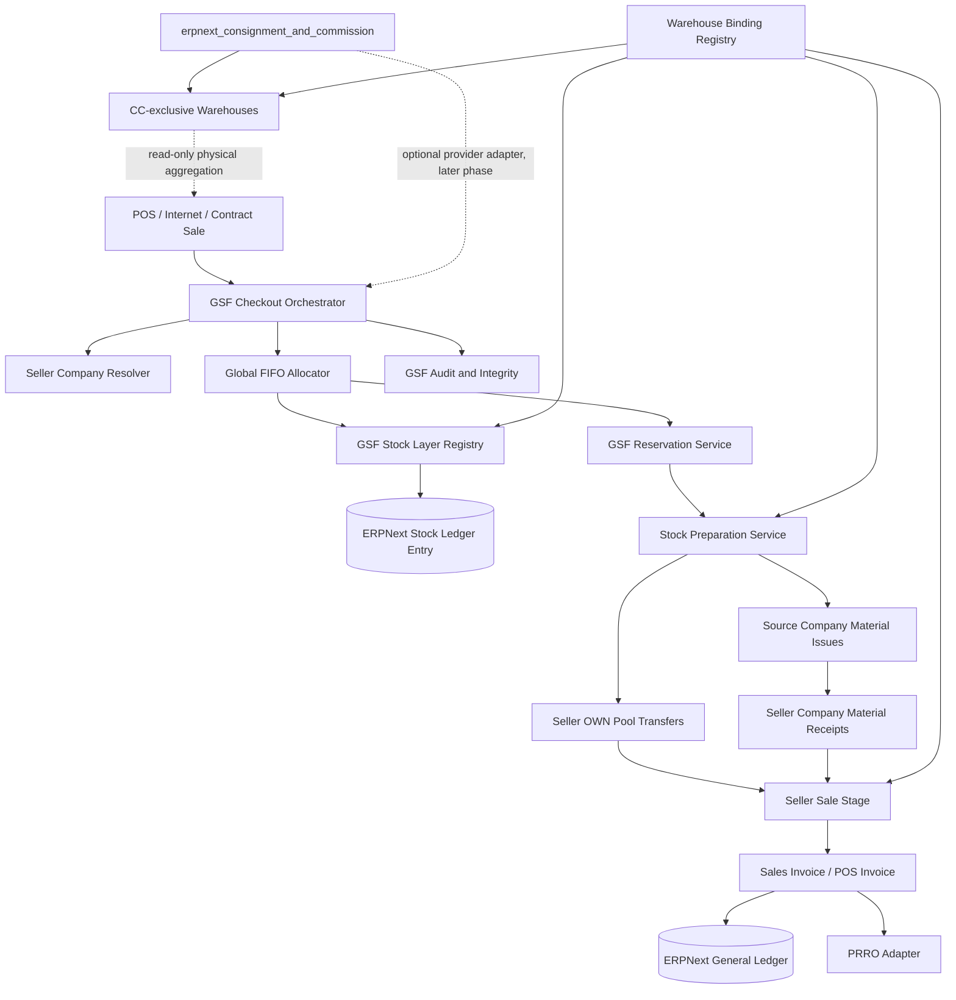
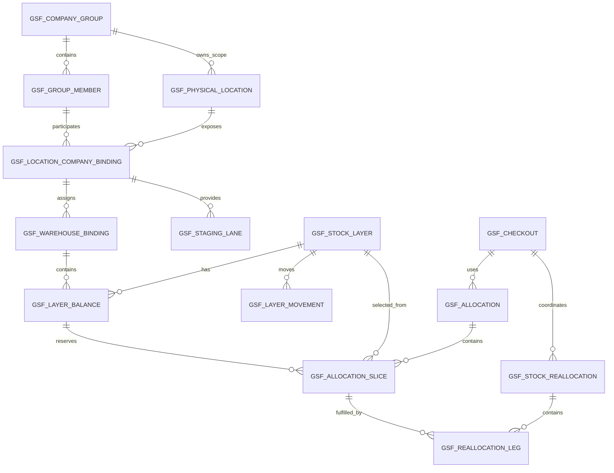
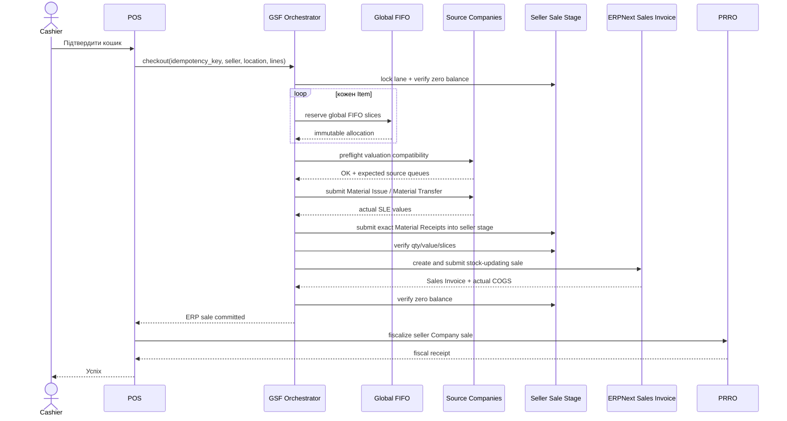
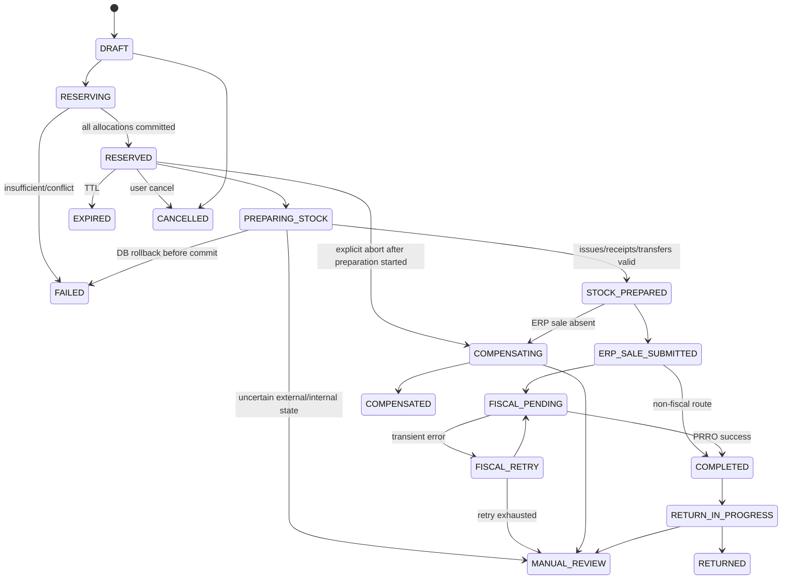

> **Примітка репозиторію, 2026-07-27.** Це базовий документ v1.0 у вигляді, у
> якому його написав власник. Зберігається **без змістовних змін**, щоб
> посилання `§N` з інших документів резолвилися. Чинні відхилення зафіксовані в
> [`README.md`](README.md) (ревізія під один застосунок), в [`adr/`](adr) і в
> [`spikes/phase-0.md`](spikes/phase-0.md). Зведення розбіжностей —
> [`spec-reconciliation.md`](spec-reconciliation.md).

# ERPNext Group Stock FIFO

## 0. Призначення документа

Цей документ є одночасно: описом бізнес-ідеї; технічним завданням для окремого
Frappe/ERPNext-застосунку; архітектурною специфікацією; переліком обов'язкових
інваріантів; планом реалізації та тестування; контрактом сумісності з
`erpnext_consignment_and_commission`; переліком ризиків і заборонених спрощень.

Документ призначений для AI-агента або команди розроблення. Перед написанням
production-коду агент повинен:

1. Прочитати документ повністю.
2. Перевірити актуальний код ERPNext v16 і встановлених застосунків.
3. Підтвердити критичні припущення короткими технічними прототипами.
4. Оформити ключові рішення як ADR.
5. Спочатку створити тести інваріантів, потім реалізацію.
6. Не змінювати ядро Frappe/ERPNext.
7. Не робити monkey patch стандартної оцінки запасів.
8. Не втручатися напряму у внутрішні таблиці іншого застосунку.

**Критично:** це не завдання «додати поле Company до залишку». Потрібна окрема
транзакційна система глобального FIFO, яка координує стандартні складські та
бухгалтерські документи кількох ERPNext Company.

## 1. Бізнес-контекст

### 1.1. Реальна модель бізнесу

Існує один спільний бізнес HUNTER: один бренд; спільне управління; один або
декілька фізичних магазинів/складів; спільний асортимент; спільний фізичний
товарний пул; одна операційна команда.

Для податкового та розрахункового контуру використовуються декілька ФОП. Кожен
ФОП у ERPNext представлений окремою `Company`.

**Облікова компанія** — ERPNext `Company`, яка відповідає конкретному ФОП або
іншому окремому суб'єкту обліку. Кількість облікових компаній не фіксована.

### 1.2. Поточна господарська логіка

Товар може закуповувати будь-яка облікова компанія. Фізично однаковий товар
зберігається в одному спільному місці. Продаж може проводити будь-яка активна
облікова компанія. Для працівника склад є спільним. Для внутрішнього обліку
необхідно зберігати, на яку компанію відбулося первинне надходження. Під час
продажу компанія-продавець визначається окремо від джерела товару. Якщо
глобально найстаріший товар належить іншій обліковій компанії, система повинна
автоматично перепризначити його компанії-продавцю. Касир не повинен бачити або
вручну створювати внутрішні документи.

### 1.3. Причина створення застосунку

Стандартний ERPNext: прив'язує кожен `Warehouse` до однієї `Company`; веде
оцінку запасів на рівні стандартного складського контуру; не підтримує один
фізичний пул запасу одночасно для довільної кількості Company; не виконує
глобальний FIFO між Company; не створює автоматичне управлінське перепризначення
перед продажем.

```text
група компаній
→ фізична локація
→ глобальні товарні шари
→ глобальне FIFO-резервування
→ JIT-перепризначення компанії
→ продаж компанією-продавцем
```

## 2. Назва, межі та ціль застосунку

### 2.1. Робоча назва

```text
erpnext_group_stock_fifo
```

Назва модуля: `Group Stock FIFO`. Префікс усіх DocType, полів, ролей, індексів,
API та фонових задач: `GSF`.

Приклади: `GSF Company Group`; `GSF Physical Location`; `GSF Stock Layer`;
`gsf_stock_layer`; `gsf_checkout_id`; `GSF Stock Manager`.

### 2.2. Головна ціль

Створити для групи з довільної кількості облікових компаній єдиний операційний
товарний пул у межах фізичної локації, зберігаючи при цьому: окремі стандартні
складські контури ERPNext за Company; початкове джерело кожного товарного шару;
глобальний FIFO без пріоритету компанії-продавця; точну вартість вибраних шарів;
нейтральність внутрішнього перепризначення для P&L; коректну собівартість
зовнішнього продажу; повний аудит; сумісність з іншими stock-domain застосунками.

### 2.3. Задача, яку вирішує застосунок

При продажу `Q` одиниць товару компанією `S` у фізичній локації `L`:

1. Знайти всі доступні товарні шари цього Item у `L` для всіх активних компаній групи.
2. Відсортувати їх за єдиним глобальним FIFO.
3. Зарезервувати точні FIFO-зрізи.
4. Визначити, які зрізи вже знаходяться в контурі компанії `S`.
5. Для зрізів інших компаній створити управлінське перепризначення до `S`.
6. Перенести точну складську вартість без внутрішньої маржі.
7. Зібрати рівно `Q` одиниць у чистому технічному складі продажу компанії `S`.
8. Створити один зовнішній продаж компанії `S`.
9. Забезпечити, щоб COGS продажу дорівнював сумі вартості глобально вибраних шарів.
10. Після завершення залишити склад продажу порожнім.

### 2.4. Що не входить до MVP

Без окремого ADR не реалізовувати: юридичний продаж/закупівлю між ФОП;
автоматичне формування податкових первинних документів між компаніями; глобальний
FIFO між різними фізичними локаціями; автоматичне перепризначення контрольованої
зброї або інших Company-bound товарів; змішування GSF та CC stock lots в одному
внутрішньому allocation engine; підтримку різних базових валют Company;
автоматичне ретроспективне перепроведення вже закритих періодів; заміну
стандартного Stock Ledger або General Ledger власним паралельним бухгалтерським
ядром.

## 3. Термінологія

| Термін | Визначення |
| --- | --- |
| Група компаній | Кастомна логічна група облікових Company, які спільно використовують фізичний товарний пул. |
| Облікова компанія | ERPNext Company, що відповідає ФОП або іншому окремому контуру. |
| Фізична локація | Реальний магазин, склад або інше місце зберігання, спільне для декількох Company. Це не ERPNext Warehouse. |
| Технічний склад | Стандартний leaf Warehouse ERPNext, службово прив'язаний до однієї Company та конкретної ролі. |
| OWN Pool | Основний GSF-технічний склад власного товару однієї Company у фізичній локації. |
| Sale Stage | Тимчасовий GSF-технічний склад компанії-продавця для точного комплектування одного checkout-потоку. |
| Товарний шар | Незмінна ідентичність первинного надходження товару з оригінальною FIFO-датою. |
| Баланс шару | Кількість одного товарного шару у конкретній Company/Warehouse. |
| Глобальний FIFO | FIFO за всіма eligible шарами Item у межах групи та фізичної локації незалежно від Company. |
| Компанія-продавець | Company, яка створює зовнішній Sales Invoice/POS Invoice, фіскалізує продаж і отримує дохід. |
| Компанія-джерело | Company, зі складу якої вибрано конкретний FIFO-зріз. |
| Управлінське перепризначення | P&L-нейтральна внутрішня передача вартості й кількості між Company без внутрішньої націнки. |
| Allocation | Атомарне резервування точних FIFO-зрізів для майбутнього checkout. |
| Slice | Частина кількості конкретного шару та складського балансу. |
| Stock-domain owner | Застосунок, який ексклюзивно керує складом і його транзакційними інваріантами. |

## 4. Непорушні інваріанти

Реалізація вважається некоректною, якщо порушено хоча б один інваріант.

### 4.1. Структурні інваріанти

Один ERPNext Warehouse належить тільки одній Company. Один leaf Warehouse має
тільки одного `stock-domain owner`. GSF не використовує Warehouse, зареєстрований
як технічний склад іншого застосунку. Фізична локація є окремою кастомною
сутністю і не підміняє Warehouse. Групова сутність HUNTER не проводить
stock/accounting транзакцій. Кількість облікових компаній не обмежується двома.
У бізнес-логіці не повинно бути полів `company_1`, `company_2`, `from_fop`,
`to_fop_2` або парних hard-coded зв'язків.

### 4.2. FIFO-інваріанти

FIFO-черга будується за `group + physical_location + item_code`. Company
продавця не дає пріоритету власним залишкам. Оригінальна FIFO-дата шару не
змінюється при перепризначенні між Company. Найстаріший eligible шар не може
бути пропущений без зафіксованої політики або причини блокування. Однаковий
вхідний стан завжди дає однаковий порядок allocation. Резервування не може
перевищувати фактичний баланс шару. Дві конкурентні операції не можуть
зарезервувати одну й ту саму кількість.

### 4.3. Вартісні інваріанти

Вартість source issue дорівнює вартості destination receipt. Внутрішнє
перепризначення не створює доходу, витрат або маржі. COGS зовнішнього продажу
дорівнює сумі вартості вибраних FIFO-зрізів. Порівнюється загальна вартість
зрізу, а не тільки округлена unit rate. Стандартний Stock Ledger Entry є
джерелом істини для фактичної складської вартості. GSF Stock Layer не є
паралельним valuation ledger. Внутрішні clearing-проводки не повинні потрапляти
в P&L.

### 4.4. Checkout-інваріанти

Один idempotency key відповідає одному payload. Повторний запит не створює
дублікати передачі, продажу або фіскального чека. Sale Stage порожній до початку
підготовки checkout. Sale Stage містить лише точну кількість поточного
checkout-потоку. Sale Stage порожній після успішного завершення або компенсації.
Продаж не фіскалізується, доки не пройшли внутрішні перевірки кількості та
вартості. Якщо фіскальний чек уже створено, заборонено виконувати простий
database rollback як спосіб скасування.

### 4.5. Сумісність

GSF не записує `CC Stock Lot`, `CC Allocation` або будь-які `cc_*` поля.
CC-застосунок не повинен бачити GSF Warehouse як власний технічний склад.
GSF-валідатори негайно завершуються для документів, які не торкаються GSF
Warehouse. GSF Warehouse не може збігатися з `CC Location.own_warehouse`,
`commission_warehouse` або `consignment_warehouse`. Встановлення GSF не змінює
поведінку звичайних ERPNext Warehouse.

## 5. Архітектура верхнього рівня



### 5.1. Джерела істини

| Дані | Джерело істини |
| --- | --- |
| Фактична складська кількість | ERPNext `Stock Ledger Entry` |
| Фактична складська вартість | ERPNext `Stock Ledger Entry.stock_value_difference` та valuation data |
| Бухгалтерські проводки | ERPNext `GL Entry` |
| Первинна FIFO-ідентичність | `GSF Stock Layer` |
| Резерв | Активний `GSF Allocation` |
| Належність Warehouse до домену | `GSF Warehouse Binding` |
| Фізична локація | `GSF Physical Location` |
| Зв'язок Company з локацією | `GSF Location Company Binding` |
| Зовнішня фіскалізація | PRRO provider + persistent checkout state |

### 5.2. Ключовий принцип

GSF не підміняє стандартний Stock Ledger. Він: класифікує стандартні stock
movements; зберігає FIFO-ідентичність; резервує точні зрізи; оркеструє
стандартні ERPNext документи; перевіряє кількісні та вартісні рівності; блокує
операцію при невизначеності.

## 6. Модель компаній і фізичних локацій

### 6.1. Група компаній

```text
GSF Company Group: HUNTER
├── ФОП / Company A
├── ФОП / Company B
├── ФОП / Company C
└── ... Company N
```

Це кастомна група домену GSF. Вона не зобов'язана бути ERPNext parent Company.
Допускається необов'язкове поле `reporting_parent_company`. На таку групову
Company заборонено проводити закупівлі, продажі, залишки, каси або ПРРО.

### 6.2. Фізична локація

```text
GSF Physical Location: HUNTER Рівне
code: RVN
address: ...
company_group: HUNTER
```

Одна фізична локація може бути прив'язана до будь-якої кількості Company групи.

### 6.3. Прив'язка Company до локації

`GSF Location Company Binding` містить: `company_group`; `physical_location`;
`company`; `enabled`; `can_purchase`; `can_sell`; `own_pool_warehouse`;
`default_sale_stage_lane`; `stock_clearing_debit_account`;
`stock_clearing_credit_account`; `cost_center`; `default_pos_profile`;
`default_prro_profile`; `base_currency_snapshot`; `activation_date`;
`deactivation_date`.

Унікальність: `company_group + physical_location + company`.

### 6.4. Приклад конфігурації для N Company

```yaml
company_group: HUNTER
base_currency: UAH
physical_locations:
  - code: RVN
    name: HUNTER Рівне
    companies:
      - company: FOP-A
        can_purchase: true
        can_sell: true
      - company: FOP-B
        can_purchase: true
        can_sell: true
      - company: FOP-C
        can_purchase: true
        can_sell: false
```

## 7. Технічні склади

### 7.1. Чому не можна створити один ERPNext Warehouse для всіх Company

ERPNext Warehouse є company-specific. Тому «один спільний склад» реалізується як:
одна `GSF Physical Location` для користувача; декілька прихованих leaf Warehouse
у стандартному ядрі; один агрегований інтерфейс залишків.

### 7.2. Обов'язкові GSF Warehouse roles

**`GSF_OWN_POOL`** — основний запас однієї облікової компанії у фізичній локації.

```text
HUNTER Рівне / FOP-A / GSF OWN Pool
HUNTER Рівне / FOP-B / GSF OWN Pool
HUNTER Рівне / FOP-C / GSF OWN Pool
```

**`GSF_SALE_STAGE`** — тимчасовий склад комплектування продажу конкретної
Company. Мінімально створюється окрема lane для кожного паралельного
checkout-потоку:

```text
HUNTER Рівне / FOP-A / GSF Sale Stage / POS-1
HUNTER Рівне / FOP-A / GSF Sale Stage / WEB
HUNTER Рівне / FOP-B / GSF Sale Stage / POS-1
```

**Одна lane не може обслуговувати два checkout одночасно.**

Необов'язкові ролі майбутніх фаз: `GSF_RETURN_QUARANTINE`;
`GSF_PHYSICAL_TRANSIT`; `GSF_RECONCILIATION_HOLD`; `GSF_DAMAGED_STOCK`.

### 7.3. Чому Sale Stage обов'язковий

Якщо старий шар іншої Company просто оприбуткувати у звичайний OWN Pool
компанії-продавця, стандартна локальна valuation queue може сприйняти це як нове
надходження. Тоді стандартний FIFO може списати інші локальні шари, а глобально
вибраний старий товар знову залишиться.

Sale Stage вирішує цю проблему: до stage переміщується тільки точна кількість
поточного checkout; у stage немає іншого запасу цього Item; продаж списує весь
підготовлений обсяг; загальна COGS stage дорівнює сумі вартості підготовлених
зрізів; після продажу stage повертається до нульового балансу.

### 7.4. Правила технічних складів

Warehouse має бути leaf. Warehouse має бути enabled. Warehouse належить рівно
одній Company. Warehouse не обирається користувачем у звичайних формах.
Warehouse не можна перейменувати/видалити без сервісу GSF. Warehouse не можна
перепризначити іншій ролі після першого stock movement. Архівування дозволене
тільки за нульового балансу й відсутності активних allocation. Ідентифікація
ролі виконується через binding, а не через назву.

### 7.5. Рекомендована ієрархія ERPNext Warehouse

```text
GSF Technical - <Company> [group]
└── <Physical Location Code> [group]
    ├── OWN Pool [leaf]
    ├── Sale Stage POS-1 [leaf]
    ├── Sale Stage POS-2 [leaf]
    └── Sale Stage WEB [leaf]
```

CC-склади розташовуються в іншій незалежній гілці:

```text
CC Technical - <Company> [group]
└── <CC Location> [group]
    ├── OWN [leaf]
    ├── COMMISSION [leaf]
    └── CONSIGNMENT [leaf]
```

Назви наведені лише як приклад. Логіка не повинна залежати від рядка назви.

## 8. Реєстр призначення складів

### 8.1. `GSF Warehouse Binding`

| Поле | Тип | Призначення |
| --- | --- | --- |
| `warehouse` | Link Warehouse | Унікальний leaf Warehouse. |
| `company` | Link Company | Має збігатися з Warehouse.company. |
| `company_group` | Link GSF Company Group | Група. |
| `physical_location` | Link GSF Physical Location | Фізична локація. |
| `manager_app` | Select | `GSF`, `CC`, `ERPNext`, `EXTERNAL`. |
| `warehouse_role` | Select/Data | Наприклад `GSF_OWN_POOL`, `CC_COMMISSION`. |
| `binding_mode` | Select | `MANAGED`, `DISCOVERED_EXTERNAL`, `READ_ONLY`. |
| `source_doctype` | Link DocType | Звідки виявлено зовнішній binding. |
| `source_name` | Dynamic Link | Наприклад конкретний `CC Location`. |
| `enabled` | Check | Активність. |
| `first_stock_posting` | Datetime | Аудит. |
| `last_integrity_check` | Datetime | Аудит. |

Унікальний індекс: `warehouse`.

### 8.2. Ексклюзивність

Один Warehouse не може мати два активні binding.

```text
Warehouse X already belongs to stock domain CC_COMMISSION.
It cannot be registered as GSF_OWN_POOL.
```

### 8.3. Автоматичне виявлення CC Warehouse

Якщо встановлено `erpnext_consignment_and_commission`, GSF readiness/migration
service повинен: перевірити наявність DocType `CC Location`; прочитати всі
активні та неактивні записи; зібрати `own_warehouse`, `commission_warehouse`,
`consignment_warehouse`; створити або оновити `DISCOVERED_EXTERNAL` binding;
позначити `manager_app = CC`; заборонити використання цих Warehouse у GSF; не
змінювати самі `CC Location`.

### 8.4. Fail-closed активація

GSF не може бути enabled, якщо: один Warehouse зустрічається у GSF та CC;
Warehouse binding має іншу Company; технічний склад є group Warehouse; stage lane
має ненульовий залишок на момент першої активації; існує unclassified stock у GSF
Warehouse; існують дублікати physical location/company binding.

## 9. Модель даних

### 9.1. Загальна ER-схема



### 9.2. `GSF Settings`

Single DocType. Обов'язкові поля: `enabled`; `schema_version`;
`allocation_ttl_minutes`; `allocation_retry_limit`; `default_reallocation_mode` =
`MANAGEMENT_REALLOCATION`; `require_same_base_currency` = `1`;
`block_negative_stock` = `1`; `block_backdated_mutations` = `1`;
`block_unmanaged_gsf_stock_docs` = `1`; `enable_cc_discovery` = `1`;
`enable_external_stock_aggregation`; `enable_cc_provider_adapter` = `0` у MVP;
`integrity_check_schedule`; `closed_through_date`; `manual_review_role`;
`debug_trace_enabled`.

Feature gate після встановлення має бути вимкнений.

### 9.3. `GSF Company Group`

Поля: `group_name`; `group_code`; `enabled`; `base_currency`;
`reporting_parent_company`; `default_global_fifo_policy`;
`default_reallocation_mode`; `default_clearing_dimension`; `notes`.

Валідації: `group_code` унікальний; усі активні member Company мають однакову
base currency в MVP; group Company, якщо вказана, не може бути member-продавцем.

### 9.4. `GSF Group Member`

Поля: `company`; `enabled`; `can_source_stock`; `can_sell_stock`; `priority` лише
для UI, не для FIFO; `intercompany_counterparty_code`;
`default_due_from_stock_account`; `default_due_to_stock_account`;
`activation_date`; `deactivation_date`.

Заборонено використовувати `priority` для зміни FIFO-порядку.

### 9.5. `GSF Physical Location`

Поля: `location_name`; `location_code`; `company_group`; `address`; `disabled`;
`timezone`; `default_inventory_cost_center`; `allow_cross_company_reallocation`;
`allow_physical_transfer_out`; `allow_external_stock_display`.

### 9.6. `GSF Location Company Binding`

Описано у розділі 6.3. Це головна конфігурація Company у локації.

### 9.7. `GSF Warehouse Binding`

Описано у розділі 8.

### 9.8. `GSF Staging Lane`

Поля: `lane_code`; `company_group`; `physical_location`; `company`; `warehouse`;
`consumer_type`: `POS_PROFILE`, `WEB`, `CONTRACT`, `API`, `MANUAL`;
`consumer_reference`; `enabled`; `current_checkout`; `lock_token`;
`last_zero_check`; `last_used_at`; `dirty_reason`; `status`: `AVAILABLE`,
`LOCKED`, `DIRTY`, `DISABLED`.

Унікальність: `warehouse`.

Перед lock:

```text
actual balance of every Item in lane = 0
```

### 9.9. `GSF Stock Layer`

Незмінна ідентичність первинного надходження.

| Поле | Призначення |
| --- | --- |
| `name` | Детермінований або naming-series ID шару. |
| `layer_status` | `PENDING`, `OPEN`, `BLOCKED`, `EXHAUSTED`, `CANCELLED`. |
| `company_group` | Група. |
| `physical_location` | Локація первинного надходження. |
| `item_code` | Item. |
| `stock_uom` | Stock UOM snapshot. |
| `origin_company` | Облікова компанія первинного надходження. |
| `origin_warehouse` | GSF OWN Pool первинного надходження. |
| `origin_doctype` | Purchase Receipt, Purchase Invoice тощо. |
| `origin_document` | Назва документа. |
| `origin_row_name` | Стабільний ID рядка. |
| `origin_row_index` | `idx`. |
| `original_received_datetime` | Незмінна глобальна FIFO-дата. |
| `original_received_qty` | Початкова кількість. |
| `tracking_type` | `NONE`, `BATCH`, `SERIAL`. |
| `batch_no` | За потреби. |
| `serial_numbers` | За потреби. |
| `return_origin_layer` | Для повернень, якщо потрібен зв'язок. |
| `created_by_service` | Аудит. |
| `blocked_reason` | Причина блокування. |

**Критичне рішення.** Не створювати поле `current_company` як єдине значення.
Причина: один шар може бути частково розподілений між декількома
Company/Warehouse. Поточний стан визначається через `GSF Layer Balance`.

Незмінні поля після OPEN: `company_group`; `item_code`; `origin_company`;
`origin_doctype`; `origin_document`; `origin_row_name`;
`original_received_datetime`; `tracking_type`; `batch_no`; origin Serial identity.

### 9.10. `GSF Layer Balance`

Ключ: `stock_layer + company + warehouse`.

Поля: `stock_layer`; `company`; `warehouse`; `physical_location`;
`warehouse_role`; `actual_qty_cache`; `reserved_qty_cache`;
`available_qty_cache`; `stock_value_cache`; `last_sle`; `last_reconciled_at`;
`integrity_status`.

Джерелом істини залишається агрегат SLE за `gsf_stock_layer`. Кеш оновлюється
транзакційно або фоновим repair job, але не може приховувати розбіжність.

### 9.11. `GSF Layer Movement`

Immutable audit event. Поля: `stock_layer`; `movement_type`; `posting_datetime`;
`source_company`; `source_warehouse`; `target_company`; `target_warehouse`;
`qty`; `stock_value`; `voucher_type`; `voucher_no`; `voucher_detail_no`;
`checkout`; `reallocation`; `idempotency_key`; `reversal_of`; `is_reversal`.

Movement types: `ORIGIN_RECEIPT`; `OWN_POOL_TO_STAGE`; `INTERCOMPANY_ISSUE`;
`INTERCOMPANY_RECEIPT`; `SALE_CONSUMPTION`; `SALE_RETURN`; `PURCHASE_RETURN`;
`RECONCILIATION`; `PHYSICAL_TRANSFER`; `REVERSAL`.

### 9.12. `GSF Allocation`

Поля: `idempotency_key` — unique; `request_fingerprint`; `status`;
`company_group`; `physical_location`; `seller_company`; `item_code`;
`requested_qty`; `allocated_qty`; `reserved_at`; `expires_at`;
`consumer_doctype`; `consumer_document`; `checkout`; `item_policy_snapshot`;
`failure_code`; `failure_message`.

```text
PENDING
RESERVED
PREPARING
PREPARED
CONSUMED
RELEASED
EXPIRED
FAILED
REVERSED
```

### 9.13. `GSF Allocation Slice`

Immutable child rows після переходу Allocation у `RESERVED`.

Поля: `sequence`; `stock_layer`; `source_company`; `source_warehouse`;
`physical_location`; `qty`; `original_fifo_datetime`; `origin_document`;
`origin_row_index`; `batch_no`; `serial_no`;
`reserved_stock_value_snapshot` — інформаційно; `source_balance_key`;
`requires_reallocation`; `reallocation_leg`; `sales_invoice_item`.

`reserved_stock_value_snapshot` не є остаточною вартістю. Фінальна вартість
береться з фактичного source SLE під час підготовки продажу.

### 9.14. `GSF Stock Reallocation`

Поля: `status`; `reallocation_mode`; `company_group`; `physical_location`;
`seller_company`; `checkout`; `allocation_set_hash`; `posting_datetime`;
`total_qty`; `total_source_value`; `total_destination_value`;
`value_difference`; `clearing_status`; `failure_code`; `manual_review_reason`;
`amended_from`.

```text
DRAFT
VALIDATING
POSTING_SOURCE
POSTING_DESTINATION
PREPARED
CONSUMED
COMPENSATING
COMPENSATED
FAILED
MANUAL_REVIEW
CANCELLED
```

### 9.15. `GSF Reallocation Leg`

Поля: `source_company`; `destination_company`; `source_warehouse`;
`destination_stage_warehouse`; `slice_set_hash`; `qty`; `source_issue`;
`destination_receipt`; `source_stock_value`; `destination_stock_value`;
`difference`; `source_clearing_account`; `destination_clearing_account`;
`counterparty_company`; `status`; `is_same_company_transfer`.

Для `is_same_company_transfer = 1` використовується стандартний Material Transfer
OWN Pool → Sale Stage і `destination_receipt` не створюється.

### 9.16. `GSF Checkout`

Persistent saga для одного зовнішнього продажу.

Поля: `idempotency_key` — unique; `request_fingerprint`;
`external_order_doctype`; `external_order_name`; `seller_company`;
`physical_location`; `staging_lane`; `customer`; `posting_datetime`; `currency`;
`conversion_rate`; `status`; `stock_state`; `erp_sale_state`; `payment_state`;
`fiscal_state`; `sales_invoice`; `prro_receipt_id`; `retry_count`;
`manual_review_reason`; `completed_at`.

### 9.17. `GSF Item Policy`

Поля: `item_code` або `item_group`; `allocation_policy`;
`allow_cross_company_reallocation`; `tracking_requirement`; `return_policy`;
`allow_backdated_receipt`; `allow_stock_reconciliation`; `external_provider`;
`manual_approval_role`.

Значення `allocation_policy`: `GLOBAL_FIFO_AUTO_REALLOCATE`;
`GLOBAL_FIFO_MANUAL_APPROVAL`; `COMPANY_BOUND`; `SERIAL_EXACT`; `BATCH_EXACT`;
`FEFO_CONTROLLED`; `EXTERNAL_PROVIDER_ONLY`; `BLOCKED`.

### 9.18. `GSF Integrity Issue`

Поля: `severity`: `INFO`, `WARNING`, `ERROR`, `CRITICAL`; `issue_code`;
`company_group`; `physical_location`; `company`; `warehouse`; `item_code`;
`stock_layer`; `reference_doctype`; `reference_name`; `detected_at`;
`details_json`; `status`; `resolved_by`; `resolution_notes`.

## 10. Inventory Dimension `GSF Stock Layer`

### 10.1. Призначення

```text
Dimension Name: GSF Stock Layer
Reference Document: GSF Stock Layer
Source Field: gsf_stock_layer
Target Field: gsf_stock_layer
Apply to stock doctypes: enabled
Validate negative stock: enabled
```

Після створення стандартні документи отримають відповідні поля, зокрема
`gsf_stock_layer`; для transfer rows — `to_gsf_stock_layer`, якщо це передбачає
ERPNext Inventory Dimension framework.

### 10.2. Роль dimension

Dimension використовується для: точного кількісного балансу шару; аудиту;
reservation; Serial/Batch identity mapping; перевірки, що вибраний slice списано
саме з потрібного шару.

**Dimension не гарантує окрему valuation queue для кожного шару.** Для
нетрекінгового Item стандартна оцінка залишається warehouse-level. Саме тому
потрібні: узгоджені OWN Pool queue; preflight valuation check; порожня Sale Stage
lane; продаж усього підготовленого обсягу.

### 10.3. Співіснування з `CC Stock Lot`

| Stock domain | `cc_stock_lot` | `gsf_stock_layer` |
| --- | --- | --- |
| GSF OWN Pool / Stage | порожнє | обов'язкове |
| CC OWN / COMMISSION / CONSIGNMENT | обов'язкове за правилами CC | порожнє |
| Звичайний ERPNext Warehouse | порожнє | порожнє |

Один stock row не може одночасно належати двом stock-domain dimensions.
Readiness повинен виконати clean-site integration test з обома dimensions.

## 11. Реєстрація первинного надходження

### 11.1. Підтримувані джерела MVP

Purchase Receipt; Purchase Invoice з `update_stock = 1`; Stock Entry
`Material Receipt` через керований GSF flow; початковий імпорт через
`GSF Opening Stock Import`; Sales Return через керований GSF return flow.
Підтримка Stock Reconciliation — тільки через окремий контрольований сценарій.

### 11.2. Створення шару

До submit: визначити, чи row входить до GSF OWN Pool; перевірити
Company/Warehouse/Physical Location binding; створити `PENDING` GSF Stock Layer з
детермінованим ключем документа й рядка; встановити `gsf_stock_layer` у row; для
Batch/Serial перевірити точну identity; дозволити стандартному ERPNext створити
SLE.

Після submit: перевірити SLE; зафіксувати `original_received_datetime` із
posting date/time документа; зафіксувати origin coordinates; перевести layer у
`OPEN`; створити `ORIGIN_RECEIPT` movement; оновити materialized balance.

У разі rollback не повинно залишитися orphan layer.

### 11.3. Детермінований layer ID

```text
site_id
+ company_group
+ origin_doctype
+ origin_document
+ origin_row_name
+ item_code
+ batch_or_serial_identity
```

Повторна обробка того самого документа повинна знайти той самий layer або
завершитися idempotently.

### 11.4. Скасування надходження

Cancel дозволено лише якщо: layer не має активних reservation; layer не був
частково/повністю переданий іншій Company; layer не був спожитий продажем; немає
залежного Landed Cost/Revaluation; період не закрито. Якщо є залежності — fail
closed і контрольована каскадна операція або manual review.

## 12. Глобальний FIFO

### 12.1. Scope

```text
company_group
+ physical_location
+ item_code
```

Не включати залишки іншої фізичної локації без окремого managed physical
transfer.

### 12.2. Eligible candidates

Активний `GSF Stock Layer`; позитивний фактичний баланс у SLE; Warehouse role =
`GSF_OWN_POOL`; Warehouse належить активному member Company тієї самої групи; та
сама фізична локація; Item policy дозволяє allocation; layer не blocked; balance
не має pending transfer; available qty = actual qty − active reserved qty > 0;
Batch/Serial відповідає запиту; stock domain = GSF; не CC Warehouse; не Sale
Stage; не quarantine/transit warehouse.

### 12.3. FIFO key

```python
(
    original_received_datetime,
    origin_doctype,
    origin_document,
    origin_row_index,
    stock_layer,
    source_company,
    source_warehouse,
)
```

Company використовується лише як детермінований tie-breaker після первинних
FIFO-полів, а не як пріоритет.

### 12.4. Псевдокод

```python
def allocate_global_fifo(request):
    assert request.qty > 0
    lock_scope(request.company_group, request.physical_location, request.item_code)

    candidates = load_gsf_candidates(
        company_group=request.company_group,
        physical_location=request.physical_location,
        item_code=request.item_code,
        tracking=request.tracking,
    )

    eligible = [c for c in candidates if policy_allows(c, request)]
    eligible.sort(key=global_fifo_key)

    remaining = request.qty
    slices = []

    for candidate in eligible:
        if remaining <= 0:
            break
        qty = min(candidate.available_qty, remaining)
        slices.append(make_slice(candidate, qty, request.seller_company))
        remaining -= qty

    if remaining > 0:
        raise InsufficientGlobalStock

    reserve_exact_slices_with_row_locks(slices)
    return persist_immutable_allocation(slices)
```

### 12.5. Приклад для трьох Company

| FIFO дата | Company | Кількість | Вартість/шт. |
| --- | --- | ---: | ---: |
| 2026-01-10 | Company A | 2 | 1 000 грн |
| 2026-02-01 | Company B | 3 | 1 100 грн |
| 2026-03-15 | Company C | 5 | 1 200 грн |

Company C продає 6 шт.:

```text
Company A: 2 × 1 000 = 2 000
Company B: 3 × 1 100 = 3 300
Company C: 1 × 1 200 = 1 200
--------------------------------
Разом:      6 шт.       6 500 грн COGS
```

Система не має права спочатку використати 5 шт. Company C лише тому, що вона є
продавцем.

### 12.6. Глобальний FIFO не обирає продавця

Company-продавець надходить у request із: POS Profile; інтернет-замовлення;
договірного продажу; маршруту платежу; уповноваженого ручного вибору. FIFO
визначає лише джерела запасу й вартість.

## 13. Резервування та конкурентність

### 13.1. Транзакційна межа

Reservation повинно стартувати в окремій DB transaction до unrelated writes:
перевірити idempotency key; заблокувати scope row `group/location/item`;
завантажити candidates current read; заблокувати layer balance rows у стабільному
порядку; створити immutable slices; атомарно збільшити reserved qty; перевести
allocation у `RESERVED`; commit.

### 13.2. Lock order

```text
1. GSF Staging Lane
2. GSF Scope Lock: group/location/item
3. GSF Allocation
4. GSF Stock Layer, sorted by name
5. GSF Layer Balance, sorted by company/warehouse/layer
6. ERPNext documents, grouped and sorted by Company
```

Усі сервіси повинні використовувати однаковий порядок.

### 13.3. TTL

Allocation має TTL. Після expiry: не може бути consumed; reserved qty
звільняється; checkout отримує статус `EXPIRED` або `FAILED`; stage preparation,
якщо вже почалась, потребує compensation, а не простого release.

### 13.4. Idempotency

Fingerprint включає: seller Company; physical location; Item; qty; Serial/Batch;
item policy; external row ID; requested posting date; checkout ID. Повторне
використання key з іншим fingerprint — hard error.

## 14. Підготовка продажу та JIT-перепризначення

### 14.1. Загальна послідовність



### 14.2. Seller-own slices

```text
Stock Entry: Material Transfer
source: seller OWN Pool
target: seller Sale Stage
GSF layer: same layer ID
qty: exact slice qty
```

Операція не змінює Company і не створює clearing balance.

### 14.3. Foreign-company slices

Source leg:

```text
Stock Entry: Material Issue
Company: source Company
Warehouse: source OWN Pool
GSF layer: original layer ID
Quantity: exact selected slice qty
Account: due-from / internal stock clearing
```

Destination leg:

```text
Stock Entry: Material Receipt
Company: seller Company
Warehouse: seller Sale Stage
GSF layer: the same original layer ID
Quantity: exact selected slice qty
Valuation amount: exact actual source issue stock value
Account: due-to / internal stock clearing
```

Звичайний Material Transfer між Company не використовується.

### 14.4. Групування документів

Для одного checkout дозволено: один Material Issue на кожну source Company, з
окремими rows за layer; один Material Receipt у seller Company на кожну source
Company або один агрегований receipt з окремими rows за source/clearing
counterparty; один Material Transfer для seller-own slices; один Sales
Invoice/POS Invoice seller Company.

Точна схема групування має бути зафіксована ADR після прототипу бухгалтерських
проводок.

### 14.5. Порядок posting datetime

Stock preparation має бути однозначно раніше sale SLE:

```text
source issue
→ destination receipt / own transfer
→ Sales Invoice
```

Не покладатися тільки на випадковий `creation` order. Якщо потрібні posting-time
offsets, вони мають: не переходити через межу дня; бути відтворюваними; зберігати
бізнес-дату; бути зафіксованими в audit snapshot.

### 14.6. Одна DB transaction

Підготовка stock і submit ERP sale повинні виконуватися в одній транзакції, якщо
стандартні Frappe/ERPNext сервіси не роблять внутрішніх commit. Заборонено
викликати `frappe.db.commit()` усередині domain service. Якщо Sales Invoice
submit завершується помилкою, source issue, destination receipt і own transfer
повинні rollback разом. External PRRO/payment side effects виконуються після ERP
commit через persistent saga.

## 15. Режим 1 — Management Reallocation

### 15.1. Обраний режим MVP

```text
MANAGEMENT_REALLOCATION
```

Внутрішній управлінський механізм: без внутрішнього продажу; без Purchase/Sales
Invoice між Company; без внутрішньої націнки; без P&L впливу; зі збереженням
кількості та вартості; з повним audit trail. Цей режим не повинен називатися
юридичною передачею або первинним документом між ФОП.

### 15.2. Бухгалтерська концепція

Source Company:

```text
Dr Internal Stock Due From / Clearing
Cr Inventory Asset
```

Seller Company:

```text
Dr Inventory Asset
Cr Internal Stock Due To / Clearing
```

Під час зовнішнього продажу seller Company:

```text
Dr COGS
Cr Inventory Asset

Dr Customer/Cash/Bank
Cr Sales Revenue
```

На рівні групової звітності clearing balances елімінуються.

### 15.3. N Company без N² рахунків

Не створювати окрему пару рахунків для кожної комбінації Company. Рекомендовано:
один `Internal Stock Due From` account у кожній Company; один
`Internal Stock Due To` account у кожній Company; обов'язковий accounting
dimension `Counterparty Accounting Company`; звірка за
`reallocation_id + source_company + destination_company`.

Якщо ERPNext setup не дозволяє потрібну проводку Stock Entry на balance-sheet
clearing account, агент повинен: довести це прототипом; описати альтернативу в
ADR; реалізувати контрольований compensating Journal Entry; перевірити нульовий
P&L. Не використовувати expense account, що потрапляє у звіт про прибутки й
збитки.

### 15.4. Майбутні режими

`LEGAL_INTERCOMPANY_SALE_PURCHASE`; `COMMISSION_MODEL`; `MANUAL_APPROVAL`;
`REALLOCATION_FORBIDDEN`. MVP реалізує тільки `MANAGEMENT_REALLOCATION`.

## 16. Точне перенесення вартості

### 16.1. Заборонені джерела вартості

Не використовувати як фінальну transfer value: last purchase rate; Item
valuation rate до submit; Price List; середню ціну групи; ціну продажу; rate з
первинного документа без урахування revaluation; округлену unit rate як єдине
джерело.

### 16.2. Правильне джерело

Після submit source Stock Entry прочитати створені SLE за `voucher_type`;
`voucher_no`; `voucher_detail_no`; `item_code`; `warehouse`; `gsf_stock_layer`.

```text
source_stock_value = abs(sum(stock_value_difference))
```

Destination receipt створюється на цю загальну суму. Після submit destination
receipt:

```text
destination_stock_value = sum(stock_value_difference)
```

Обов'язкова рівність у base currency:

```text
abs(source_stock_value - destination_stock_value) <= configured_currency_tolerance
```

### 16.3. Округлення

Для fractional UOM: quantity зберігати у stock UOM precision ERPNext; total value
зберігати у base currency precision; unit valuation rate обчислювати з достатньою
внутрішньою precision; останній row leg може отримати rounding remainder;
equality перевіряється за total value.

### 16.4. Контроль після продажу

```text
actual_sale_cogs = abs(sum(sale SLE stock_value_difference))
prepared_stage_value = sum(stage incoming stock_value_difference)
```

Обов'язково `actual_sale_cogs == prepared_stage_value`. Якщо ні — transaction
rollback до зовнішньої фіскалізації.

## 17. Preflight valuation compatibility

### 17.1. Проблема

GSF layer dimension веде точний quantity audit, але стандартний ERPNext може
оцінювати нетрекінговий товар за warehouse-level queue. Якщо layer ledger і
фактична valuation queue розійшлися, Material Issue може списати іншу вартість,
ніж очікує global layer order.

### 17.2. Обов'язковий preflight

Перед створенням source issue для кожної source Company/Item/Warehouse: отримати
глобально вибрані slice; відтворити фактичну локальну valuation queue
стандартними API/даними ERPNext; перевірити, що quantity, яку ERPNext спише
наступною, відповідає вибраним GSF layers у тому самому порядку або принаймні дає
точну очікувану total value для повного selected quantity; перевірити відсутність
unclassified stock; перевірити відсутність backdated pending repost; перевірити
відсутність negative stock.

При невідповідності `error_code = VALUATION_QUEUE_DIVERGENCE`. Продаж блокується
до repair/manual review.

### 17.3. Як мінімізувати divergence

У GSF OWN Pool приймати товар тільки з `gsf_stock_layer`. Заборонити прямі
unmanaged Stock Entry. Перепризначені шари передавати одразу в Sale Stage, а не в
seller OWN Pool. Повернення за замовчуванням створювати як новий шар із новою
FIFO-датою. Контролювати backdated documents. Після Landed Cost/Repost запускати
GSF integrity check. Заборонити змішаний classified/unclassified balance.

## 18. Продаж і технічні рядки

### 18.1. Sales Invoice

```text
company = seller_company
update_stock = 1
warehouse = seller Sale Stage
```

### 18.2. Один користувацький рядок — декілька технічних rows

Якщо один Item складається з декількох FIFO slices, ERPNext invoice повинен мати
окремий stock row для кожного slice, щоб зберегти `gsf_stock_layer`.

Користувач бачить `Item X — 6 шт. — 1 500 грн/шт.` ERPNext зберігає:

```text
Row 1: Item X, qty 2, layer A
Row 2: Item X, qty 3, layer B
Row 3: Item X, qty 1, layer C
```

Усі rows мають: однаковий `display_group_id`; посилання на GSF
Allocation/Slice; seller Sale Stage Warehouse; правильний Serial/Batch;
rate/discount/tax allocation, що зберігає тотали користувацького рядка.

### 18.3. Глобальні ERPNext settings

Readiness має перевірити можливість додавати один Item декілька разів у
транзакцію в Buying/Selling Settings. GSF не повинен мовчки змінювати його без
audit.

### 18.4. Друк і фіскалізація

Backend rows можуть бути об'єднані для відображення/друку лише через
контрольований renderer: Item; rate; tax; discount; UOM; legally relevant
attributes мають збігатися. Оригінальні ERP rows і layer links не видаляються.

## 19. Повернення покупця

### 19.1. Базове правило

```text
original seller Company = return Company
```

Компанія первинного надходження товару не визначає Company повернення.

### 19.2. Політика FIFO для повернення MVP

Для нетрекінгового товару повернена кількість створює новий `GSF Stock Layer`:

```text
origin_company = seller Company
original_received_datetime = return posting datetime
return_origin_layer = original sold layer
```

Причина: відновлення старої історичної FIFO-дати може вставити товар у минуле
глобальної черги й не відповідати фактичній локальній valuation queue.

### 19.3. Serial/Batch

Exact restore тільки після окремого ADR. За замовчуванням контрольований товар
повертається у `GSF_RETURN_QUARANTINE` і не бере участі в автоматичному FIFO до
перевірки.

### 19.4. Скасування до завершення продажу

Якщо Sales Invoice не submitted і PRRO side effect відсутній: release
reservation; rollback/compensate stock preparation; повернути stage до нуля; не
створювати return layer.

Якщо Sales Invoice submitted або фіскалізація відбулася: використовувати
стандартний return/correction workflow; не видаляти audit documents; створити
reversal links.

## 20. Інвентаризація спільного фізичного складу

### 20.1. Фізичний підрахунок

```text
Company A GSF OWN Pool: 5
Company B GSF OWN Pool: 7
Company C GSF OWN Pool: 6
CC / external visible stock: 0
--------------------------------
GSF allocatable total: 18
Physical difference: -1
```

### 20.2. Розподіл нестачі/надлишку

Автоматичний розподіл за замовчуванням заборонено. Доступні керовані політики:
списати з вибраного шару/Company; списати з глобально найстарішого шару; списати
з глобально найновішого шару; пропорційно; ручний розподіл; відправити в manual
review.

Production default: `MANUAL_APPROVAL`.

### 20.3. `GSF Physical Stock Count`

Окремий документ повинен: зберігати фізичний count; показувати GSF, CC та
external balances окремими доменами; створювати adjustment plan; вимагати
approval; генерувати контрольовані Stock Reconciliation/Stock Entry;
встановлювати правильний `gsf_stock_layer`; не редагувати CC balances напряму.

## 21. Контрольовані товари та Item Policy

### 21.1. Company-bound товар

```text
allocation_policy = COMPANY_BOUND
allow_cross_company_reallocation = 0
```

Глобальна доступність може показуватися інформаційно, але автоматичний allocator
використовує лише баланс seller Company.

### 21.2. Serial Exact

Serial No однозначно визначає layer і Company; FIFO не може підмінити явно
вибраний Serial; якщо Serial належить іншій Company, застосовується дозволена
reallocation policy; для забороненої категорії продаж блокується.

### 21.3. Batch Exact / FEFO

Якщо batch вибрано явно — allocation тільки в ньому; без явного batch діє Item
Policy; default GSF policy залишається global FIFO; FEFO дозволяється лише для
окремих Item Group і має бути явно позначено як виняток із FIFO.

### 21.4. Зовнішній stock domain

```text
allocation_policy = EXTERNAL_PROVIDER_ONLY
```

GSF не створює власний layer поверх зовнішнього lot.

## 22. Сумісність з `erpnext_consignment_and_commission`

### 22.1. Вихідні факти про CC-застосунок

Поточний CC-застосунок: має `CC Location`, прив'язану до однієї Company; вимагає
окремі `own_warehouse`, `commission_warehouse`, `consignment_warehouse`; вимагає,
щоб вони були distinct leaf Warehouse тієї самої Company; веде immutable
`CC Stock Lot`; використовує Inventory Dimension `cc_stock_lot`; має власний
global FIFO в межах Item/Company/CC Location; має atomic reservation та
`CC Allocation`; fail-closed контролює Sales Invoice, що торкається CC Warehouse;
не дозволяє звичайний продаж із CC Warehouse без CC-managed allocation.

### 22.2. Головний контракт сумісності

**Один Warehouse — один stock-domain owner.** GSF і CC не можуть одночасно
керувати тим самим leaf Warehouse.

### 22.3. Warehouse matrix

| Warehouse role | Owner | GSF allocator | CC allocator | Звичайний ERPNext sale |
| --- | --- | --- | --- | --- |
| GSF OWN Pool | GSF | так | ні | ні, тільки GSF-managed |
| GSF Sale Stage | GSF | тільки поточний checkout | ні | ні, тільки GSF-managed |
| CC OWN | CC | ні у MVP | так | ні, тільки CC-managed |
| CC COMMISSION | CC | ні | так | ні, тільки CC-managed |
| CC CONSIGNMENT | CC | ні | так | ні, тільки CC-managed |
| Ordinary Warehouse | ERPNext | ні | ні | так |

### 22.4. Обов'язкова ізоляція hooks

```python
def gsf_before_submit(doc, method=None):
    touched = get_touched_warehouses(doc)
    if not touched.intersection(get_gsf_managed_warehouses()):
        return

    if touched.intersection(get_cc_managed_warehouses()):
        raise WarehouseDomainConflict

    validate_gsf_document(doc)
```

На CC Sales Invoice GSF handler повинен повернутися без дій. На GSF Sales Invoice
CC handler не повинен знайти CC Warehouse, тому також не втручається.

### 22.5. Заборонені способи інтеграції

Monkey patch `CCStockLotCandidateAdapter`. Прямий SQL update `tabCC Stock Lot`.
Створення `CC Allocation` без публічного CC API. Заповнення `cc_stock_lot` у GSF
Warehouse. Реєстрація `CC Location.own_warehouse` як `GSF_OWN_POOL`. Продаж CC
stock через GSF Sales Invoice. Переміщення COMMISSION/CONSIGNMENT lot між Company
через GSF Management Reallocation. Використання назви Warehouse як єдиного
способу визначити CC role.

### 22.6. Рекомендований deployment profile

```text
GSF: ordinary OWN stock
CC: COMMISSION + CONSIGNMENT
```

Якщо `CC Settings.enable_buyout` або `enable_deferred_purchase` активні,
readiness GSF повинен показати warning, що власний товар може бути розділений між
двома незалежними allocation domains.

### 22.7. Фізичне агрегування без транзакційного змішування

```text
Physical stock at HUNTER Рівне
├── GSF allocatable OWN: 12
├── CC OWN: 2
├── CC COMMISSION: 3
├── CC CONSIGNMENT: 1
└── Total physically visible: 18
```

Але `GSF allocatable total = 12` поки не реалізовано provider adapter.

### 22.8. `GSF External Location Binding`

`gsf_physical_location`; `provider_app = erpnext_consignment_and_commission`;
`external_location_doctype = CC Location`; `external_location_name`; `company`;
`read_stock_enabled`; `transaction_adapter_enabled`; `provider_version_snapshot`;
`last_sync_check`.

### 22.9. Майбутній provider adapter

```python
class StockDomainProvider(Protocol):
    def list_candidates(self, request) -> list[ExternalCandidate]: ...
    def reserve(self, request) -> ExternalReservation: ...
    def release(self, reservation_id, reason) -> None: ...
    def prepare_for_sale(self, reservation_id, seller_context) -> PreparedRoute: ...
    def consume(self, reservation_id, sale_reference) -> None: ...
    def reverse(self, sale_reference, return_context) -> ReversalResult: ...
```

Вимоги: тільки публічний versioned API; idempotency; immutable slices; без
прямого доступу до CC tables; окремі fiscal/financial routes; provider
залишається власником своїх warehouse та lot.

### 22.10. Mixed checkout

До появи provider adapter: один UI-кошик може бути проаналізований; GSF і CC
lines повинні бути розділені на окремі backend routes; кожен route створюється
власним застосунком; оплата/друк/фіскалізація координуються checkout
orchestrator; якщо безпечний split не налаштований — mixed checkout блокується.

GSF не повинен «тимчасово» копіювати CC stock у GSF Warehouse.

### 22.11. Обов'язкові compatibility tests

Обидва apps встановлюються на clean site в будь-якому підтримуваному порядку.
Повторний `bench migrate` idempotent. Дві Inventory Dimension співіснують. CC
Warehouse discovery працює. GSF activation блокує warehouse overlap. CC managed
receipt/sale/return проходять без GSF side effects. GSF receipt/sale/return
проходять без CC side effects. Ordinary Warehouse працює стандартно.
Uninstall/disable одного feature gate не пошкоджує інший domain. Upgrade CC
baseline запускає compatibility suite.

## 23. Checkout state machine



### 23.1. Рекомендовані checkout statuses

```text
DRAFT
RESERVING
RESERVED
PREPARING_STOCK
STOCK_PREPARED
ERP_SALE_SUBMITTED
FISCAL_PENDING
FISCAL_RETRY
COMPLETED
EXPIRED
CANCELLED
COMPENSATING
COMPENSATED
FAILED
MANUAL_REVIEW
RETURN_IN_PROGRESS
RETURNED
```

### 23.2. Різниця між rollback і compensation

**Rollback** — якщо всі внутрішні ERP documents ще в одній незакоміченій DB
transaction.

**Compensation** — якщо transaction уже committed; external side effect міг
відбутися; source/destination documents існують у різних завершених кроках; стан
не можна достовірно повернути простим rollback. Compensation створює reversal
documents, а не видаляє audit evidence.

## 24. Fail-closed контроль стандартних документів

### 24.1. Документи, які торкаються GSF Warehouse

Purchase Receipt; Purchase Invoice; Stock Entry; Stock Reconciliation; Delivery
Note; Sales Invoice; Batch; Serial No; Landed Cost Voucher; Repost Item
Valuation; Stock Closing Entry, якщо використовується у v16.

### 24.2. Дозволені unmanaged actions

У GSF Warehouse немає повністю unmanaged stock actions. Стандартна Purchase
Receipt/Purchase Invoice може залишатися користувацькою формою, але hooks GSF
повинні: створити layer; заповнити dimension; перевірити binding; зафіксувати
audit.

### 24.3. Заборонені прямі операції

Sales Invoice напряму з GSF OWN Pool. Sales Invoice зі stage без `GSF Checkout`.
Stock Entry Material Issue з GSF OWN Pool без GSF service token. Material
Transfer до/зі stage без активного checkout. Stock Reconciliation у GSF Warehouse
без approved GSF count/repair. Ручне очищення `gsf_stock_layer`. Ручне змішування
classified та unclassified qty. Від'ємний залишок.

### 24.4. Internal write flag

```python
@contextmanager
def gsf_managed_write(operation_id: str):
    ...
```

Flag локальний до request/worker context; завжди відновлюється у `finally`; не є
єдиним захистом; document має immutable GSF reference/idempotency key; submit
validator перевіряє payload, а не тільки flag.

## 25. Backdated operations, revaluation та period close

### 25.1. Найвищий ризик

Backdated receipt, Landed Cost, purchase return або repost valuation можуть
змінити: порядок глобального FIFO; локальну valuation queue; historical COGS;
вартість уже виконаного intercompany reallocation; profit seller Company.

### 25.2. MVP policy

Блокувати backdated stock documents раніше `closed_through_date`; блокувати зміну
origin document, якщо layer уже transferred або sold; блокувати Landed Cost для
receipt із downstream cross-company movement без controlled workflow; після
Repost Item Valuation створювати `GSF Integrity Issue`; не автоматично
переписувати completed fiscal sales; вимагати manual review для історичних
розбіжностей.

### 25.3. Майбутній `GSF Global Revaluation`

```text
origin receipt
→ GSF stock layer
→ source issue
→ destination receipt
→ sale stage
→ Sales Invoice COGS
→ returns/reversals
```

Механізм повинен: перерахувати layer values; створити difference adjustments;
синхронно коригувати source/destination clearing; не змінювати quantity history;
зберігати попередній immutable snapshot; враховувати closed periods; не змінювати
фіскальну суму зовнішнього продажу.

### 25.4. Period close

`GSF Period Close` фіксує: дату закриття; inventory integrity report; zero stage
report; open allocations; open reallocations; intercompany clearing
reconciliation; unresolved integrity issues; hash звіту. Закриття не дозволяється
з CRITICAL issues.

## 26. Переміщення між фізичними локаціями

### 26.1. Межа MVP

```text
Group + Physical Location + Item
```

### 26.2. Чому звичайний transfer небезпечний

Переміщення шару в іншу локацію може: додати старий шар у кінець локальної
valuation queue; порушити відповідність layer order та ERPNext FIFO; змінити
доступний глобальний порядок у двох локаціях.

### 26.3. MVP rule

Прямі Material Transfer між GSF OWN Pool різних physical locations заборонені.
Дозволяється лише `GSF Physical Transfer` із: exact layers; source valuation
preflight; transit state; destination queue compatibility check; preservation of
original FIFO datetime; manual approval для нетрекінгового товару, якщо queue
cannot be proven; exact Serial/Batch support. Якщо безпечність не доведена —
transfer fail closed.

## 27. Versioned API

```text
/api/method/erpnext_group_stock_fifo.api.v1
```

### 27.1. Read-only API

**`GET /availability`** — параметри `company_group`; `physical_location`;
`item_code`; optional `seller_company`; optional `include_external_domains`.
Відповідь розрізняє: `physical_visible_qty`; `gsf_allocatable_qty`;
`seller_company_qty`; `other_company_qty`; `reserved_qty`; `blocked_qty`;
`external_domain_qty`; `oldest_fifo_datetime`; `integrity_status`.

**`POST /allocation/preview`** — read-only, не резервує stock.

**`GET /diagnostics/readiness`**, **`GET /diagnostics/financial-integrity`**,
**`GET /checkout/status`**.

### 27.2. Mutation API

**`POST /allocation/reserve`**:

```json
{
  "idempotency_key": "order-123:line-1",
  "company_group": "HUNTER",
  "physical_location": "HUNTER Rivne",
  "seller_company": "FOP-B",
  "item_code": "ITEM-001",
  "qty": 5,
  "serial_no": null,
  "batch_no": null,
  "external_row_id": "line-1"
}
```

**`POST /allocation/release`** — reason is required.
**`POST /checkout/prepare`** — creates persistent checkout plan.
**`POST /checkout/execute`** — internal stock preparation and ERP sale.
**`POST /checkout/retry-fiscalization`**.
**`POST /checkout/compensate`** — requires elevated role and reason.
**`POST /sale/return`**.
**`POST /integrity/reconcile`** — never destructive repair without dry-run and
approval.

### 27.3. API response contract

`operation_id`; `idempotency_key`; `status`; `document_references`; `retryable`;
`manual_review_required`; `error_code`; `user_message`; `technical_trace_id`.
Не повертати клієнту необроблений traceback.

## 28. Сервісна архітектура

### 28.1. Domain services

```text
GroupService
PhysicalLocationService
WarehouseRegistryService
LayerRegistrationService
LayerBalanceService
CandidateProviderService
GlobalFIFOAllocator
ReservationService
ValuationPreflightService
StockPreparationService
ReallocationService
StagingLaneService
ManagedSaleService
CheckoutSagaService
ReturnService
IntegrityService
CCDiscoveryService
ExternalProviderRegistry
ReportingService
```

### 28.2. Рекомендована структура застосунку

```text
erpnext_group_stock_fifo/
├── hooks.py
├── modules.txt
├── patches.txt
├── api/v1/
├── group_stock_fifo/
│   ├── doctype/
│   ├── services/
│   ├── integrations/
│   ├── providers/
│   ├── setup/
│   ├── reports/
│   └── tests/
├── docs/
└── .github/workflows/
```

### 28.3. Чисті domain functions

FIFO, fingerprint, state transitions, value reconciliation та policy resolution
повинні бути реалізовані як pure Python functions там, де можливо.

### 28.4. Frappe integration boundary

У `integrations/` розміщувати: database queries; `frappe.get_doc`; document
creation/submit; SLE/GL reading; locks; hooks; permissions; scheduler tasks.
Domain layer не повинен напряму залежати від UI.

## 29. Hooks

### 29.1. Загальний принцип

Hooks мають бути вузькими, idempotent і domain-aware. Рекомендовані `doc_events`
для: Purchase Receipt; Purchase Invoice; Stock Entry; Stock Reconciliation; Sales
Invoice; Landed Cost Voucher; Batch; Serial No.

### 29.2. Hook ordering

Не покладатися на порядок hooks між installed apps як на business invariant.
Сумісність досягається через disjoint warehouse sets і early return.

### 29.3. Native ERPNext documents

Якщо document не торкається GSF Warehouse і не містить GSF managed flags, handler
повинен завершитися без читання зайвих domain records.

### 29.4. Custom fields

Префікс `gsf_`. Мінімально — `gsf_stock_layer` і `to_gsf_stock_layer` на
Purchase Receipt Item / Purchase Invoice Item / Stock Entry Detail;
`gsf_managed_operation`, `gsf_reallocation`, `gsf_checkout`,
`gsf_idempotency_key`, `gsf_posting_kind` на Stock Entry; `gsf_managed_sale`,
`gsf_checkout`, `gsf_idempotency_key`, `gsf_request_fingerprint`,
`gsf_external_order`, `gsf_physical_location` на Sales Invoice; `gsf_allocation`,
`gsf_allocation_slice`, `gsf_stock_layer`, `gsf_display_group_id`,
`gsf_external_row_id` на Sales Invoice Item; read-only `gsf_is_technical`,
`gsf_warehouse_binding`, `gsf_physical_location`, `gsf_warehouse_role` на
Warehouse.

Поле Warehouse є лише зручним snapshot. Канонічним є `GSF Warehouse Binding`.

## 30. Readiness та діагностика

### 30.1. Feature activation

`GSF Settings.enabled` можна увімкнути тільки за порожнього списку blocking
checks.

### 30.2. Blocking checks

ERPNext major version = 16. `erpnext_ua` встановлено. Inventory Dimension
синхронізована. Усі custom fields і indexes існують. Negative stock
заблокований для GSF. Buying/Selling multiple Item rows сумісні. Усі Company
групи мають однакову base currency. Усі Company мають stock asset, COGS, income,
clearing accounts і cost center. Усі Warehouse binding валідні. Немає GSF/CC
overlap. Stage lanes порожні. Немає unclassified balance, orphan
`gsf_stock_layer` SLE, розбіжних layer balance, протермінованих reservation,
pending repost valuation, unresolved CRITICAL integrity issues. PRRO adapter
readiness, якщо fiscal checkout required.

### 30.3. Warnings

CC buyout/deferred enabled; external provider stock not allocatable by GSF;
Company може sell без stage lane; Company може source без own pool; old ordinary
stock outside GSF domain; opening layers have estimated FIFO dates; physical
transfer disabled; closed period not configured.

### 30.5. Scheduler jobs

Expiry reservations; stage zero check; warehouse binding discovery; layer/SLE
reconciliation; clearing account reconciliation; stuck checkout monitor;
compatibility fingerprint monitor; period close readiness.

## 31. Звіти та UI

`GSF Physical Inventory`; `GSF Global FIFO Queue`; `GSF Reallocation Audit`;
`GSF Sale Margin` (seller / origin / group views); `GSF Stranded Stock`;
`GSF Financial Integrity`; `GSF Checkout Queue`.

### 31.8. Касовий інтерфейс

Касир бачить: спільний фізичний залишок; доступно до продажу; зарезервовано;
seller Company; ціну; кошик; один результат checkout.

Касир не бачить: source Company кожного slice; internal Material Issue/Receipt;
clearing accounts; transfer values; layer repair actions.

## 32. Ролі та права

```text
GSF Stock User
GSF Stock Manager
GSF Accountant
GSF Auditor
GSF System Manager
GSF Manual Review Operator
```

Користувач може працювати лише з Company, до яких має стандартний ERPNext User
Permission, але агрегований physical stock може показувати total без розкриття
фінансових деталей інших Company.

## 33. Error model

```text
GSF_NOT_ENABLED
GROUP_NOT_FOUND
COMPANY_NOT_GROUP_MEMBER
LOCATION_NOT_ACTIVE
SELLER_NOT_ALLOWED
WAREHOUSE_BINDING_MISSING
WAREHOUSE_DOMAIN_CONFLICT
CC_WAREHOUSE_CONFLICT
STAGE_LANE_BUSY
STAGE_LANE_DIRTY
INSUFFICIENT_GLOBAL_STOCK
ITEM_POLICY_BLOCKED
COMPANY_BOUND_STOCK
SERIAL_AMBIGUOUS
BATCH_MISMATCH
ALLOCATION_CONFLICT
ALLOCATION_EXPIRED
IDEMPOTENCY_CONFLICT
UNCLASSIFIED_GSF_STOCK
NEGATIVE_STOCK_RISK
VALUATION_QUEUE_DIVERGENCE
SOURCE_VALUE_MISSING
TRANSFER_VALUE_MISMATCH
STAGE_VALUE_MISMATCH
SALE_COGS_MISMATCH
CLEARING_ACCOUNT_MISSING
CLEARING_IMBALANCE
BACKDATED_OPERATION_BLOCKED
CLOSED_PERIOD
PENDING_REPOST
EXTERNAL_PROVIDER_UNAVAILABLE
CC_PROVIDER_UNSUPPORTED
FISCALIZATION_RETRYABLE
FISCALIZATION_UNCERTAIN
COMPENSATION_FAILED
MANUAL_REVIEW_REQUIRED
```

Кожна помилка має: user-safe повідомлення; technical details; trace ID; retryable
flag; manual review flag; suggested remediation.

## 34. Спостережуваність та аудит

### 34.1. Structured logging

Обов'язкові coordinates: `trace_id`; `operation_id`; `checkout_id`;
`allocation_id`; `reallocation_id`; `company_group`; `physical_location`;
`seller_company`; `source_company`; `item_code`.

### 34.2. Metrics

allocation latency; checkout latency; number of source Company per checkout;
reallocated qty/value; stranded stock age; reservation conflicts;
deadlocks/retries; dirty stages; value mismatches; manual review count; PRRO
retries; CC compatibility warnings.

### 34.3. Audit immutability

Після завершення операції заборонено редагувати: allocation slices; layer
movement; value snapshots; document links; idempotency keys; request
fingerprints. Корекції виконуються reversal/amend documents.

## 35. Основні ризики

| № | Ризик | Наслідок | Контроль |
| ---: | --- | --- | --- |
| 1 | Розбіжність GSF layer order і ERPNext valuation queue | Невірний COGS | Preflight, stage isolation, fail-closed, integrity report |
| 2 | Backdated receipt/revaluation | Зміна історичного FIFO/COGS | Period close, block, controlled global revaluation |
| 3 | Два checkout резервують один stock | Overselling | Row locks, scope locks, atomic reservation, TTL |
| 4 | Stage використовується паралельно | Чужий layer у sale | Окрема lane, exclusive lock, zero checks |
| 5 | Source issue committed, sale failed | Розірваний stock state | Одна DB transaction або compensation saga |
| 6 | PRRO невизначений результат | Дубль/відсутність чека | Idempotency, persistent fiscal state, lookup/retry |
| 7 | GSF Warehouse збігається з CC Warehouse | Взаємне блокування hooks | Warehouse registry, discovery, activation block |
| 8 | Один Item керується двома apps | Подвійний FIFO/layer | Stock-domain ownership, explicit item/provider policy |
| 9 | Unclassified stock у GSF Warehouse | Неможливо довести FIFO | Fail closed, migration/repair |
| 10 | Різні base currencies Company | Неточна transfer value/FX | Same-currency MVP; future explicit FX strategy |
| 11 | Округлення fractional qty | Value imbalance | Total-value reconciliation, remainder row |
| 12 | Direct manual Stock Entry | Зламаний layer ledger | Hooks, roles, managed flags, audit |
| 13 | Stock Reconciliation без layer | Втрата traceability | GSF count workflow only |
| 14 | Landed Cost після cross-company sale | Historical mismatch | Block/controlled revaluation/manual review |
| 15 | Повернення зі старою FIFO-датою | Queue divergence | New return layer by default |
| 16 | Multiple Item rows disabled | Неможливо відобразити slices | Readiness check |
| 17 | ERPNext upgrade змінює SLE behavior | Фінансовий дефект | Version pin, clean-site CI, acceptance suite |
| 18 | CC upgrade змінює technical warehouse/API behavior | Compatibility regression | Baseline fingerprint, integration CI |
| 19 | Deadlocks між items/companies | Checkout failure | Deterministic lock order, bounded retry |
| 20 | Велика кількість layers | Повільний FIFO | Composite indexes, materialized balances, pagination |
| 21 | Opening stock без історичної дати | Неточний FIFO | Controlled import, confidence flag, approved order |
| 22 | Помилкова Company-продавець | Невірний чек/дохід | Seller route validation before allocation |
| 23 | Source Company disabled after reservation | Stuck checkout | Revalidate at prepare; manual review |
| 24 | Clearing accounts не звіряються | Невірний balance sheet | Nightly reconciliation, period close block |
| 25 | Видалення технічного Warehouse | Втрата audit links | Prevent delete/rename after movement |
| 26 | Mixed GSF/CC cart без orchestrator | Некоректний єдиний sale | Split routes or block |
| 27 | Physical transfer changes queue | FIFO inconsistency | Separate managed flow; MVP restriction |
| 28 | Serial/Batch identity mismatch | Продаж не тієї одиниці | Exact mapping, unique constraints, locks |
| 29 | Negative stock enabled globally | SLE/queue corruption | GSF-level hard block regardless global setting |
| 30 | Repair job самостійно змінює фінанси | Непомітна корекція | Dry-run, approval, immutable repair plan |

## 36. Security considerations

Не довіряти seller Company з клієнтського UI без permission/routing validation.
Не дозволяти клієнту передавати довільний Warehouse. Не дозволяти клієнту
передавати valuation rate. Не дозволяти клієнту підміняти allocation slice.
Перевіряти request fingerprint на сервері. Використовувати standard Frappe
permission checks плюс domain validation. Internal mutation API доступні лише
service role. Manual review/compensation потребує reason і elevated role. Секрети
PRRO не зберігати в GSF logs. Audit JSON не повинен містити приватні ключі або
повні платіжні дані. External provider responses вважати недовіреними до
server-side validation.

## 37. Acceptance tests

Усі сценарії мають перевіряти не тільки статус документа, а й: SLE quantity; SLE
stock value difference; GL entries; layer balances; allocation state; stage
balance; clearing balances; COGS; idempotency; audit links.

### 37.1. Базовий global FIFO для трьох Company

```text
Location L
Item X
Company A: 2 @ 100, FIFO date 01-Jan
Company B: 3 @ 110, FIFO date 05-Jan
Company C: 5 @ 120, FIFO date 01-Feb
Seller: Company C
Sale qty: 6
```

Expected: allocation A2 + B3 + C1; source issue A = 200; source issue B = 330;
seller own transfer C = 120; destination stage total = 650; sale qty = 6; sale
COGS = 650; A remains 0; B remains 0; C OWN remains 4 @ 120; stage = 0; internal
reallocation P&L = 0.

### 37.2. Seller має достатній власний, але новіший stock

```text
A: 2 old
B seller: 10 new
Sale: 2
```

Expected: вибирається A2; B own stock не використовується; A stock не залишається
stranded.

### 37.3. Частковий старий layer

```text
A layer: 10 @ 100
Sale by B: 3
```

Expected: той самий layer ID має source issue qty 3; після sale balance A = 7;
stage = 0; layer origin data immutable.

### 37.4. Декілька source Company в одному checkout

Перевірити N = 5, sale використовує slices із 4 Company. Не повинно бути
hard-coded two-party behavior.

### 37.5. Один checkout із декількома Item

Окремі locks за Item; одна stage lane; всі allocations успішні або весь checkout
fail; stage zero після sale.

### 37.6. Insufficient stock

Reservation не створює часткового committed hold; жодного Stock Entry; зрозумілий
`INSUFFICIENT_GLOBAL_STOCK`.

### 37.7. Concurrency

Два workers одночасно продають останні 5 одиниць. Один отримує reservation;
другий отримує conflict/insufficient після retry; reserved qty не перевищує
actual; немає negative stock.

### 37.8. Idempotent retry

Повторити той самий checkout request 5 разів: один GSF Checkout; один набір
allocations; один набір Stock Entry; один Sales Invoice; один fiscal operation ID.

### 37.9. Idempotency conflict

Той самий key, інша qty → `IDEMPOTENCY_CONFLICT`. Без mutation.

### 37.10. Stage busy

Lane already locked by active checkout → другий checkout не входить у lane; може
бути routed до іншої lane або отримує `STAGE_LANE_BUSY`.

### 37.11. Dirty stage

Stage має 1 unclassified або classified unsold qty → checkout block; CRITICAL
integrity issue; жодної автоматичної «очистки».

### 37.12. Source value exactness

Layers із дробовою unit value: issue total = receipt total; rounding remainder
контрольований; sale COGS = prepared total.

### 37.13. Valuation queue divergence

Навмисно створити unclassified/queue inconsistency → `VALUATION_QUEUE_DIVERGENCE`
без source issue.

### 37.14. Failure after source issue creation

Inject exception до destination receipt submit у тій самій DB transaction: source
issue відсутній після rollback; allocation залишається RESERVED або переходить у
recoverable state; stage zero.

### 37.15. Failure after ERP commit before PRRO

Sales Invoice існує; stock consumed; checkout `FISCAL_PENDING/FISCAL_RETRY`;
повтор не створює другий Sales Invoice; PRRO retry використовує той самий
idempotency context.

### 37.16. Return

return Company = seller; новий return layer; link to original allocation;
revenue/COGS reversal correct; stage not used as permanent storage.

### 37.17. Cancel draft sale

Reservation release; no stale stage qty; no orphan reallocation.

### 37.18. Cancel submitted sale

Тільки controlled return/reversal; direct cancel blocked, якщо downstream fiscal
state не узгоджений.

### 37.19. Company-bound Item

Oldest stock is in A, seller B: no automatic transfer; sale uses only B if
available or blocks; clear error.

### 37.20. Serial exact

Exact Serial selected; no substitute by FIFO; one active allocation per Serial;
return maps same Serial.

### 37.21. Batch exact

Selected Batch only; no cross-batch silent allocation; expiry policy test
separately.

### 37.22. Same base currency requirement

Group member with different base currency → activation blocked; no implicit FX.

### 37.23. P&L neutrality

```text
sum(reallocation-related P&L GL entries) = 0
```

Group clearing balance should reconcile by counterparty.

### 37.24. CC coexistence — installation

```text
A. install CC → install GSF
B. install GSF → install CC
C. migrate twice
D. feature CC on / GSF off
E. CC off / GSF on
F. both on
```

All supported states pass.

### 37.25. CC Warehouse overlap

Attempt to bind CC commission warehouse as GSF own pool →
`CC_WAREHOUSE_CONFLICT`. Activation blocked.

### 37.26. CC managed sale unchanged

CC receipt → reservation → managed sale → settlement → return: all existing CC
tests pass; no GSF documents created; `gsf_stock_layer` blank.

### 37.27. GSF managed sale with CC installed

CC validator early-exits because no CC Warehouse; GSF flow completes;
`cc_stock_lot` blank.

### 37.28. Ordinary ERPNext Warehouse

Standard purchase/sale in unbound Warehouse: no GSF layer; no CC lot; standard
behavior unchanged.

### 37.29. External physical aggregation

Map CC Location to GSF Physical Location: report displays CC qty as external; GSF
allocator excludes it; no transactional mutation.

### 37.30. Performance

100 000 stock layers; 10 Company; 10 locations; 20 active layers per hot Item;
concurrent POS load. Allocation query повинна використовувати composite indexes і
не scan all historical exhausted layers.

### 37.31. Property-based tests

allocated total = requested; slices ordered by key; no slice > available; no
candidate skipped before later candidate без policy reason; deterministic output;
N Company symmetry; total quantity conservation; total value conservation.

### 37.32. Repeated migration

`bench migrate` двічі/тричі: не дублює dimensions; не дублює
fields/indexes/bindings; не змінює immutable data; не активує feature gate.

## 38. Міграція та запуск

### 38.1. Принцип cutover

1. Зупинити stock mutations.
2. Зробити backup.
3. Провести фізичну інвентаризацію.
4. Визначити Company та документи первинного надходження для доступних даних.
5. Створити GSF technical warehouses.
6. Розподілити accounting balances по Company.
7. Імпортувати opening layers.
8. Звірити quantity/value.
9. Увімкнути shadow/read-only mode.
10. Пройти acceptance tests.
11. Лише потім увімкнути mutation feature gate.

### 38.2. `GSF Opening Stock Import`

Для кожного рядка: Item; physical location; accounting Company; qty; total stock
value; original FIFO datetime; confidence level; source document reference;
Batch/Serial; target own pool.

```text
DOCUMENT_CONFIRMED
DATE_CONFIRMED_VALUE_ESTIMATED
DATE_ESTIMATED_VALUE_CONFIRMED
ESTIMATED
```

Estimated rows повинні бути видимі в audit/report.

### 38.3. FIFO порядок opening stock

Якщо точні дати невідомі: використовувати затверджену послідовність; не
вигадувати псевдоточний timestamp; зберегти `fifo_date_confidence`; отримати
approval; зафіксувати migration hash.

### 38.4. Переміщення stock у GSF Warehouse

Не робити прямий bulk transfer без layer mapping. Migration service повинен
створити: Stock Reconciliation або Material Receipt із `gsf_stock_layer`; opening
SLE; layer movement; balance records; reconciliation report.

### 38.5. CC stock

CC Warehouse не переміщується в GSF під час базової міграції. Зберігається у CC
domain і лише мапиться до physical location для read-only aggregation.

### 38.6. Rollback plan

До mutation activation: uninstall/disable GSF safe; layers можуть бути видалені
тільки разом із opening transaction у rehearsal site.

Після production stock movements: не видаляти audit data; feature можна disable
для нових mutations; stock залишається у стандартних ERPNext Warehouse; потрібен
контрольований exit plan з export layer balances і standard stock reconciliation.

## 39. CI та quality gates

### 39.1. Python

`ruff check`; `python -m compileall`; `pytest` pure domain tests; type checking,
якщо прийнято в repo; no import-time Frappe side effects у pure modules.

### 39.2. Frappe clean-site integration

Підняти Frappe/ERPNext v16; встановити `erpnext_ua`; встановити GSF; виконати
migrate; запустити integration suite; повторити migrate. Окремий job із CC
baseline і ще один із зворотним порядком інсталяції.

### 39.3. Database matrix

Production-target DB version має відповідати підтримуваній ERPNext v16
конфігурації. Locks та SQL тестуються на фактичній MariaDB версії.

### 39.4. Failure injection

Exception після reservation; після першого source issue; після destination
receipt; перед Sales Invoice submit; після Sales Invoice commit; до/після PRRO
call; під час compensation.

### 39.5. Financial golden tests

Fixtures з очікуваними SLE; GL Entry; stock value; COGS; clearing balances;
return reversal. Будь-яка зміна golden output потребує review.

### 39.6. Upgrade gate

Оновити compatibility baseline; запустити повний clean-site suite; перевірити SLE
ordering/valuation; перевірити hooks/custom fields; оформити release acceptance
document.

## 40. Обов'язкові ADR перед production-кодом

- **ADR-001 — Stock-domain ownership.** Exclusive Warehouse registry і взаємодія з CC.
- **ADR-002 — Inventory Dimension coexistence.** `gsf_stock_layer` разом із `cc_stock_lot`.
- **ADR-003 — Exact-value intercompany reallocation.** source SLE value → destination receipt equality.
- **ADR-004 — Posting order.** Deterministic stock preparation before sale.
- **ADR-005 — Balance-sheet clearing accounting.** P&L neutrality на фактичному плані рахунків `erpnext_ua`.
- **ADR-006 — Stage lane isolation.** Lane granularity та lock model.
- **ADR-007 — Valuation queue preflight.** Порівняння GSF layer selection зі стандартною ERPNext queue.
- **ADR-008 — Transaction boundary.** Rollback source/destination/sale в одній DB transaction.
- **ADR-009 — Return FIFO policy.** New-layer default і Serial/Batch exceptions.
- **ADR-010 — Backdated/revaluation policy.** MVP blocks і майбутній revaluation engine.
- **ADR-011 — CC compatibility contract.** Exact baseline paths/API та upgrade process.
- **ADR-012 — POS/PRRO saga.** Internal commit, external side effects, retry та manual review.

## 41. Етапи реалізації

**Phase 0 — Research spikes.** Дві/три Company на clean site; company-specific own
pools; source Material Issue на balance-sheet clearing; destination Material
Receipt з exact value; Sale Stage exact COGS; rollback all internal documents;
Inventory Dimension coexistence з CC; hook isolation з CC; valuation queue
preflight prototype. Результат: ADR; executable integration tests; список
підтверджених/спростованих припущень.

**Phase 1 — Foundation.** app skeleton; settings/roles/workspace; Company Group;
Physical Location; bindings; warehouse provisioning; CC discovery; readiness;
feature gate off.

**Phase 2 — Layer registry.** Inventory Dimension; receipt hooks; Stock Layer;
Layer Balance; Layer Movement; opening import; integrity report.

**Phase 3 — Global FIFO reservation.** candidates; deterministic allocator; locks;
TTL; idempotency; Serial/Batch; availability API.

**Phase 4 — Stock reallocation.** preflight; source issue; destination receipt;
same-company transfer; clearing accounting; exact value checks; stage lane.

**Phase 5 — Managed sale.** Sales Invoice builder; technical slice rows; COGS
validation; checkout saga; compensation; reports.

**Phase 6 — POS/PRRO.** POS adapter; persistent fiscal state; payment plan;
retries; print queue; manual review.

**Phase 7 — Returns and inventory count.** controlled return; new return layers;
physical count; approved adjustments; quarantine.

**Phase 8 — Hardening.** load tests; deadlock tests; failure injection; period
close; runbooks; production acceptance.

**Phase 9 — Optional external providers.** read-only CC aggregation already in
MVP; transaction provider interface; mixed checkout split; no direct CC table
writes.

## 42. Перше завдання для AI-агента

```text
GSF Architecture Validation Pack
```

Має містити: `ADR-001-stock-domain-ownership`;
`ADR-002-inventory-dimension-coexistence`; `ADR-003-exact-value-reallocation`;
`ADR-004-posting-order`; `ADR-005-clearing-accounting`; minimal Frappe test app
або spike branch; integration test із 3 Company та global FIFO example;
integration test з CC installed/enabled; SLE/GL evidence tables; рішення `GO`,
`GO WITH CONSTRAINTS` або `REVISE ARCHITECTURE`.

### 42.1. Питання, на які spike має дати доказову відповідь

1. Чи можна провести Material Issue на потрібний balance-sheet clearing account
   без некоректного P&L?
2. Чи destination Material Receipt може точно прийняти фактичну source stock value?
3. Чи standard ERPNext sale зі stage дає COGS, рівний stage value?
4. Чи Inventory Dimension layer коректно переноситься в SLE source/target?
5. Чи одна DB transaction rollback усі stock docs і sale?
6. Як ERPNext ordering працює при однакових posting datetime?
7. Як надійно отримати/відтворити local valuation queue?
8. Чи два inventory dimensions не конфліктують у forms/SLE?
9. Чи CC hooks залишаються inert для GSF Warehouse?
10. Які custom settings обов'язкові для duplicate Item rows?

Без цього pack не переходити до повної реалізації.

## 43. Definition of Done

Усі ADR прийняті; feature gate за замовчуванням off; clean install та repeated
migrate проходять; N Company architecture доведена тестом мінімум із 3 Company;
global FIFO не має seller-first behavior; старі шари інших Company автоматично
вибираються раніше нових seller layers; source value = destination value; sale
COGS = prepared stage value; internal reallocation P&L = 0; stage lanes завжди
zero після завершених/компенсованих checkout; concurrency не створює overselling;
idempotency не допускає дублікати; return workflow завершений;
backdated/revaluation risks fail closed; CC compatibility suite зелений; GSF/CC
warehouse overlap неможливий; ordinary ERPNext warehouses не змінюють поведінку;
readiness не має blocking checks; financial integrity report зелений; runbook
backup/rollout/rollback/manual review готовий; production acceptance виконаний на
staging-копії реальних даних.

## 44. Заборонені спрощення

Агенту заборонено:

- Створювати один Warehouse без Company.
- Відключати стандартну перевірку Warehouse.company.
- Редагувати Stock Ledger Entry напряму.
- Редагувати GL Entry напряму.
- Підміняти global FIFO локальним seller-first FIFO.
- Спочатку списувати stock seller Company «для зменшення документів».
- Приймати старий foreign layer у seller OWN Pool перед продажем без доведення
  queue correctness.
- Вважати custom layer ledger джерелом фінансової вартості замість SLE.
- Передавати за last purchase rate.
- Створювати внутрішню маржу в Management Reallocation.
- Використовувати P&L expense account як постійний clearing workaround.
- Комітити source issue окремо без recovery design.
- Використовувати один stage для паралельних checkout без lock/lane isolation.
- Автоматично очищати dirty stage.
- Дозволяти negative stock.
- Пропускати valuation mismatch із warning.
- Прямо змінювати CC Stock Lot/Allocation.
- Використовувати CC Warehouse як GSF Warehouse.
- Змішувати `cc_stock_lot` і `gsf_stock_layer` на одному stock row.
- Визначати warehouse role тільки за назвою.
- Hard-code дві Company.
- Створювати N² business logic для пар Company.
- Відновлювати стару FIFO-дату повернення без ADR.
- Мовчки перепроводити закриті періоди.
- Ігнорувати PRRO uncertain state.
- Видаляти completed audit records замість reversal.
- Вмикати feature gate під час install/migrate.
- Випускати production-реліз без clean-site CC compatibility tests.

## 45. Runbooks, які треба створити

`installation.md`; `initial-setup.md`; `warehouse-provisioning.md`;
`opening-stock-migration.md`; `cc-coexistence.md`; `readiness.md`;
`manual-review.md`; `dirty-stage-recovery.md`; `stuck-allocation.md`;
`clearing-imbalance.md`; `valuation-divergence.md`; `prro-uncertain-result.md`;
`period-close.md`; `backup-and-restore.md`; `disable-and-exit.md`;
`upgrade-erpnext.md`; `upgrade-cc-module.md`.

Кожен runbook повинен містити: симптом; safe diagnostics; що не можна робити;
remediation; verification; rollback/escalation.

## 46. Архітектурні посилання на сумісний CC-застосунок

```text
Repository: romboman19/erpnext_consignment_and_commission
Branch: main
Release: 1.1.0
Commit: 5714aca75dfe4a28ab6f0dd3970d21741aef69e2
```

Критичні файли, які агент повинен повторно перевірити перед реалізацією:

```text
README.md

erpnext_consignment_and_commission/hooks.py

erpnext_consignment_and_commission/consignment_and_commission/
  doctype/cc_location/cc_location.json
  doctype/cc_location/cc_location.py
  doctype/cc_stock_lot/cc_stock_lot.json
  doctype/cc_settings/cc_settings.json
  services/foundation.py
  services/allocation.py
  services/candidates.py
  integrations/candidates.py
  integrations/reservations.py
  integrations/sales_invoice.py
  integrations/pos.py
  setup/ownership_dimension.py
```

Compatibility baseline не є дозволом імпортувати internal functions як стабільний
API. До появи окремого versioned provider contract інтеграція з CC є:

```text
warehouse discovery + read-only aggregation + route isolation
```

## 47. Підсумкова концепція

```text
HUNTER
= одна управлінська група

ERPNext Company A ... Company N
= окремі облікові компанії

GSF Physical Location
= один реальний магазин/склад

GSF OWN Pool per Company
= прихований company-specific стандартний склад

GSF Stock Layer
= незмінна первинна FIFO-ідентичність

GSF Layer Balance
= кількість шару за Company/Warehouse

Global FIFO
= один порядок усіх eligible GSF layers у фізичній локації

Seller Company
= визначається продажем, а не FIFO

Foreign oldest slices
= JIT Management Reallocation у seller Sale Stage

Sale Stage
= точна підготовлена кількість і вартість конкретного checkout

Sales Invoice seller Company
= зовнішній дохід і COGS

Internal reallocation
= quantity/value transfer, P&L = 0

CC technical warehouses
= окремий stock domain без warehouse overlap
```

**Головний результат застосунку:** товар фізично залишається спільним, кількість
і вартість ведуться у стандартних company-specific контурах ERPNext, а кожен
продаж списує справді найстаріші шари всього фізичного складу незалежно від того,
яка облікова компанія є продавцем.
